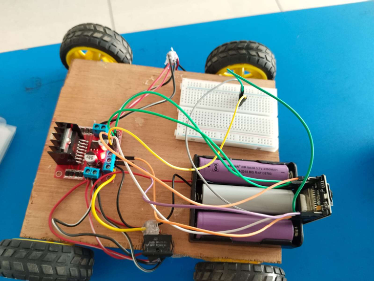

# ESP32-CAM-Surveillance-Car
A Wi-Fi controlled surveillance camera car using ESP32-CAM, L298N motor driver, and DC motors with live video streaming through a web interface.

## Important
The code is for arduinoIDE and one must install all the libraries included in the code along with esp32 board version 2.1.1x within the IDE beforehand to avoid errors while compiling and safetly run the code and upload it onto the board. Remember esp32 board version must be same as listed here to avoid complications and errors.

---

## Project Overview
The aim of this project is to design and implement a surveillance camera car using the **ESP32-CAM** module, which can stream live video to a web browser over a wireless network and move in multiple directions using motor control[cite: 1, 2, 3, 4, 5, 6]. 

The goal is to provide a low-cost, wireless, and flexible surveillance solution for monitoring purposes in various scenarios, such as security, exploration, or monitoring of hazardous areas[cite: 1, 2, 3, 4, 5, 6]. The project focuses on integrating the ESP32-CAM with motor control systems, enabling users to control both video streaming and vehicle movement via a web interface[cite: 1, 2, 3, 4, 5, 6].

---

## Project Prototype & Circuit Diagram

### Circuit Diagram

### Prototype Hardware

---

## Components Used

| S.No. | Component | Quantity | Description |
| :---: | :--- | :---: | :--- |
| **2.1** | **ESP32-CAM Module** | 1 | Low-cost board integrating the ESP32 microcontroller and a 2MP camera[cite: 1, 2, 3, 4, 5, 6]. Runs a small web server to stream video over Wi-Fi[cite: 1, 2, 3, 4, 5, 6]. Supports Wi-Fi & Bluetooth with I/O pins for peripherals[cite: 1, 2, 3, 4, 5, 6]. |
| **2.2** | **Motor Driver Module (L298N)** | 1 | H-Bridge driver used to control DC motor direction (forward, reverse, turn) and speed via ESP32-CAM signals[cite: 1, 2, 3, 4, 5, 6]. |
| **2.3** | **DC Motors with Wheels** | 4 | Two sets of DC motors connected to the driver to power and drive the car's movement[cite: 1, 2, 3, 4, 5, 6]. |
| **2.4** | **Chassis** | 1 | Physical frame (plastic, metal, or wood) to mount motors, ESP32-CAM, battery pack, and motor driver[cite: 1, 2, 3, 4, 5, 6]. |
| **2.5** | **Li-ion Battery Pack** | 1 | Rechargeable 18650 Li-ion pack supplying continuous power to the ESP32-CAM, motor driver, and motors[cite: 1, 2, 3, 4, 5, 6]. |
| **2.6** | **Jumper Wires** | — | Used for interconnecting components on breadboard or direct terminal points[cite: 1, 2, 3, 4, 5, 6]. |
| **2.7** | **Breadboard / PCB** | 1 | Used for neat, non-permanent connection setups or PCB for permanent assembly[cite: 1, 2, 3, 4, 5, 6]. |

---

## Key Connections

| From | To | Connection Detail |
| :--- | :--- | :--- |
| **ESP32-CAM** | **L298N Motor Driver** | GPIO pins connected to **IN1, IN2, IN3, IN4** to issue movement signals[cite: 1, 2, 3, 4, 5, 6]. |
| **Battery Pack** | **L298N Motor Driver** | Powers the motor driver to supply current to the DC motors[cite: 1, 2, 3, 4, 5, 6]. |
| **Li-ion Battery** | **ESP32-CAM** | 5V supply connected to the **5V pin** to power board and camera[cite: 1, 2, 3, 4, 5, 6]. |
| **DC Motors** | **L298N Motor Driver** | Motors wired to **OUT1, OUT2, OUT3, OUT4** terminal blocks[cite: 1, 2, 3, 4, 5, 6]. |
| *(Optional)* | **Voltage Regulator** | Regulates battery input to guarantee a stable 5V line to the ESP32-CAM[cite: 1, 2, 3, 4, 5, 6]. |

---
